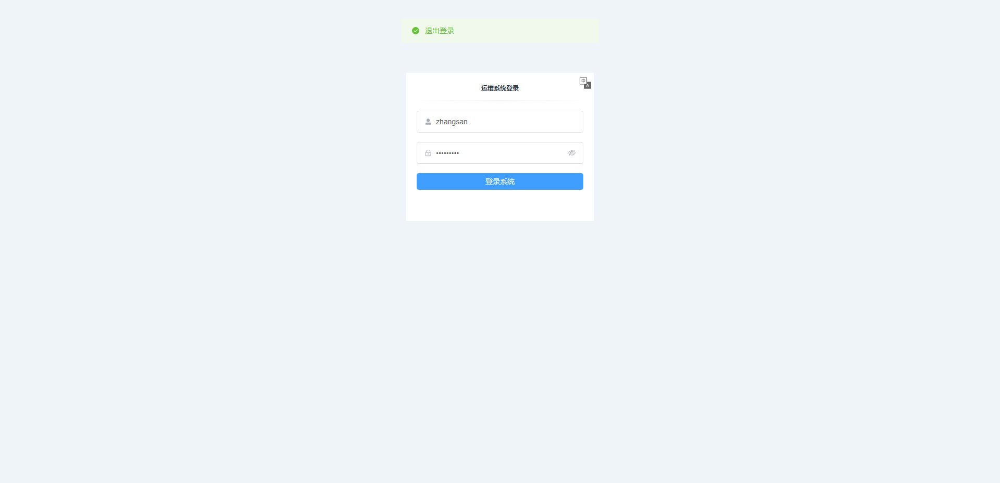
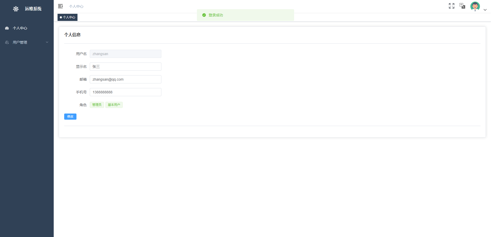
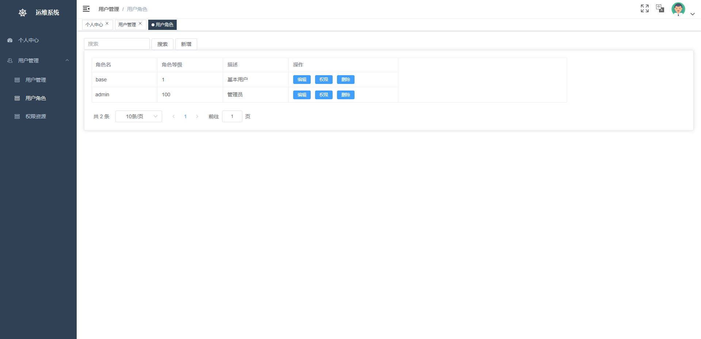

# 悟空后台管理系统前端 Demo

## 介绍

基于 Vue3 和Element Plus 开发，目前已经实现了基本的后台管理系统界面







## 配套后端

https://github.com/sanmuyan/wukong-admin

## 快速启动

```shell
git clone https://github.com/sanmuyan/wukong-web-demo.git
cd wukong-web-demo
yarn add
yarn run serve
```
